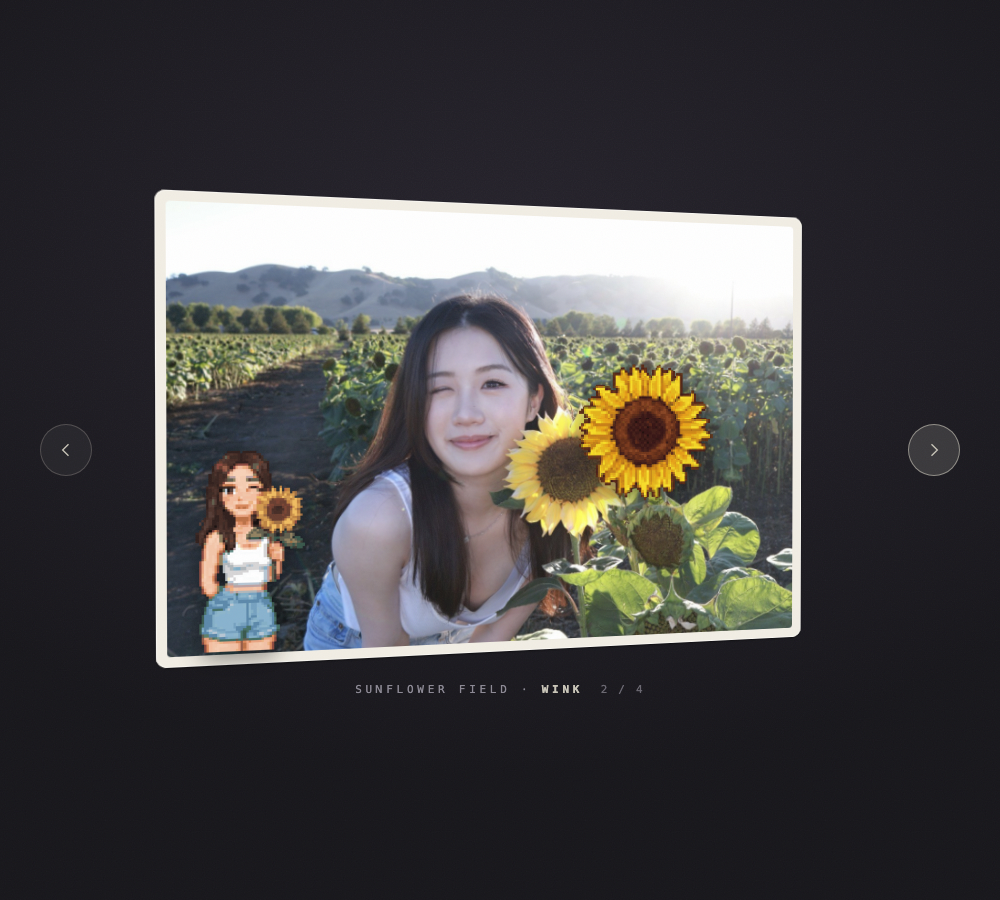

# aesthetic-ops

A hub of skills and prompts for generating striking visuals — for content creation, video generation, slides, posts, and beyond.

Like DevOps, but for aesthetics: reusable, battle-tested recipes that turn "make it look good" into an operational capability.

## What lives here

- **Skills** — self-contained instruction sets (e.g. Claude skills) that produce a specific visual style or effect
- **Prompts** — curated prompts for image/video generation models that reliably hit a distinctive look
- **Collections** — pointers to interesting open-source visual skills from around the ecosystem

## Skills

| Skill | What it makes |
|---|---|
| [`pixel-tilt-card`](plugins/pixel-tilt-card/skills/pixel-tilt-card/) | Photos → an interactive 3D-tilting card page: pixel-art sprites of the photo's own subjects float in front and overhang the edges; multiple photos become an arrow-navigable deck. Single self-contained HTML file. |

## Showcase: pixel-tilt-card

**[▶ Open the live demo](https://lingjiefeng.github.io/aesthetic-ops/examples/pixel-tilt-card/field-notes.html)** — hover to tilt, use the arrows (or ←/→) to flip cards.

<!-- To add a demo video: open this README on github.com, click the pencil
     (edit), and drag your screen recording (.mp4/.mov, under 100MB) into the
     editor right here. GitHub uploads it and inserts an embedded player;
     commit and the video plays inline. -->

Each card is a real photo; the pixel-art figures are that photo's own
subjects, redrawn by an image model and floating in front of the card at
their own depths:

| | | |
|---|---|---|
|  |  |  |

### Install

**Claude Code marketplace** (recommended):

```
/plugin marketplace add lingjiefeng/aesthetic-ops
/plugin install pixel-tilt-card@aesthetic-ops
```

Invoke with `/pixel-tilt-card:pixel-tilt-card`.

**Manual** — copy the skill into your skills directory:

```bash
git clone https://github.com/lingjiefeng/aesthetic-ops.git
cp -R aesthetic-ops/plugins/pixel-tilt-card/skills/pixel-tilt-card ~/.claude/skills/
```

Invoke with `/pixel-tilt-card`.

**Other coding agents** — hand them the repo link and let them follow
[`SKILL.md`](plugins/pixel-tilt-card/skills/pixel-tilt-card/SKILL.md):

```
https://github.com/lingjiefeng/aesthetic-ops
```

### Using it

Set a (free) Gemini key once — it draws the pixel sprites:

```bash
export GEMINI_API_KEY=...   # https://aistudio.google.com/apikey
```

Then name your photos and, optionally, what to lift out of each:

```
/pixel-tilt-card ~/photos/beach.jpg (the dog and the surfer), ~/photos/city.jpg (the red car)
```

Say nothing about subjects and it picks 1–3 itself. You get a single
self-contained `.html` file — open it, hover it, send it to someone.
Requires [`uv`](https://docs.astral.sh/uv/); the first run also downloads a
~50MB depth model, then works offline.

Tweaking afterwards needs no re-processing: sprite positions, sizes, tilt
weight and glare all live in a `CONFIG` block at the top of the generated
file. Edit, reload. Full details in the
[skill README](plugins/pixel-tilt-card/skills/pixel-tilt-card/).

## Structure

```
.claude-plugin/     marketplace catalog (this repo is an installable marketplace)
plugins/            one directory per plugin; each holds skills/<name>/
examples/           demo output per skill — illustration, not shipped in installs
prompts/            standalone prompts, organized by medium
```

## Adding a skill

Each skill lives at `plugins/<plugin>/skills/<skill>/` with a `SKILL.md` describing:

1. **What it produces** — the visual outcome, ideally with an example
2. **When to use it** — the kind of content it fits
3. **The instructions/prompt itself**
