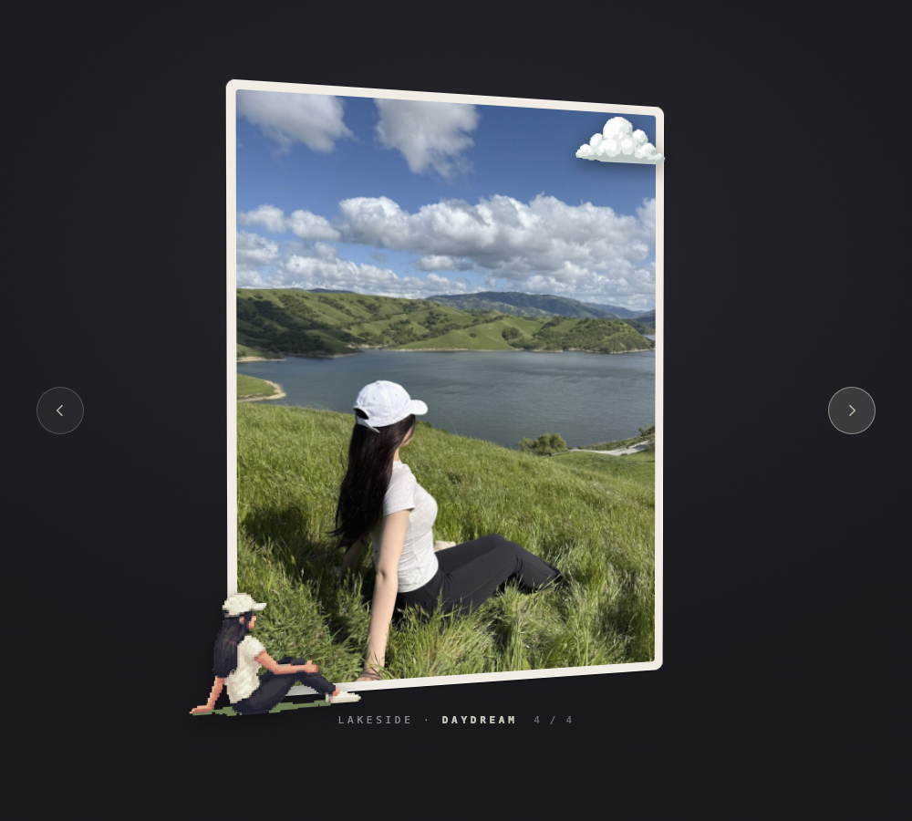

# aesthetic-ops

A hub of skills and prompts for generating striking visuals — for content creation, video generation, slides, posts, and beyond.

Like DevOps, but for aesthetics: reusable, battle-tested recipes that turn "make it look good" into an operational capability.

## What lives here

- **Skills** — self-contained instruction sets (e.g. Claude skills) that produce a specific visual style or effect
- **Prompts** — curated prompts for image/video generation models that reliably hit a distinctive look
- **Collections** — pointers to interesting open-source visual skills from around the ecosystem

## Skills

| Skill | What it makes |
|---|---|
| [`pixel-tilt-card`](skills/pixel-tilt-card/) | Photos → an interactive 3D-tilting card page: pixel-art sprites of the photo's own subjects float in front and overhang the edges; multiple photos become an arrow-navigable deck. Single self-contained HTML file. |

## Showcase: pixel-tilt-card

**[▶ Open the live demo](https://lingjiefeng.github.io/aesthetic-ops/skills/pixel-tilt-card/examples/field-notes.html)** — hover to tilt, use the arrows (or ←/→) to flip cards.

<!-- To add a demo video: open this README on github.com, click the pencil
     (edit), and drag your screen recording (.mp4/.mov, under 100MB) into the
     editor right here. GitHub uploads it and inserts an embedded player;
     commit and the video plays inline. -->

Each card is a real photo; the pixel-art figures are that photo's own
subjects, redrawn by an image model and floating in front of the card at
their own depths:

| | | |
|---|---|---|
|  |  |  |

### Using it

Install once — clone this repo and link the skill into Claude Code:

```bash
git clone https://github.com/lingjiefeng/aesthetic-ops.git
ln -s "$PWD/aesthetic-ops/skills/pixel-tilt-card" ~/.claude/skills/pixel-tilt-card
export GEMINI_API_KEY=...   # free key: https://aistudio.google.com/apikey
```

Then just ask Claude Code, naming the photos and (optionally) what to lift
out of each:

```
/pixel-tilt-card ~/photos/beach.jpg (the dog and the surfer), ~/photos/city.jpg (the red car)
```

Say nothing about subjects and it picks 1–3 itself. You get a single
`.html` file — open it, hover it, send it to someone. Requires `uv`; the
first run also downloads a ~50MB depth model, then works offline.

Tweaking afterwards needs no re-processing: sprite positions, sizes, tilt
weight and glare all live in a `CONFIG` block at the top of the generated
file. Edit, reload. Full details in the
[skill README](skills/pixel-tilt-card/).

## Structure

```
skills/     # one directory per skill (SKILL.md + supporting assets)
prompts/    # standalone prompt files, organized by medium
  video/
  image/
  slides/
```

## Adding a skill

Each skill gets its own directory under `skills/` with a `SKILL.md` describing:

1. **What it produces** — the visual outcome, ideally with an example
2. **When to use it** — the kind of content it fits
3. **The instructions/prompt itself**
